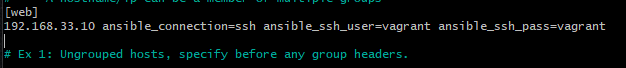
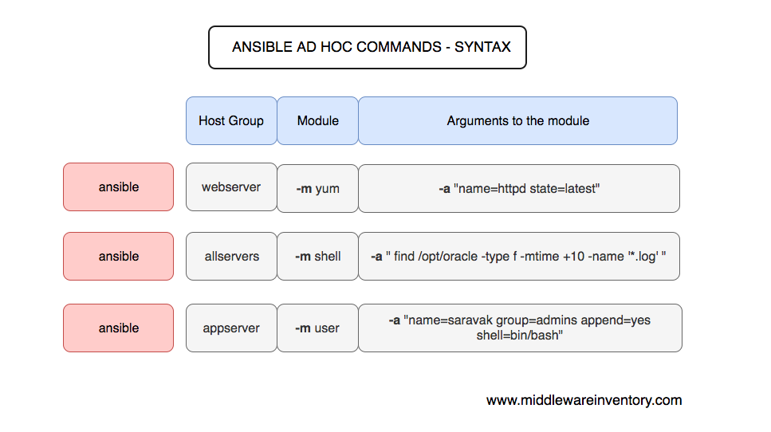

# Infrastructure-as-Code-IaC-
Infrastructure as Code (IaC)

## What is IaC
IaC stands for Infrastructure as Code, which is an approach to managing infrastructure using code rather than manual processes. With IaC, developers can write code to define and manage infrastructure resources such as servers, networks, and storage, just like they would write code for applications.

## Why do we use IaC

We use IaC to automate the process of infrastructure management and make it easier to deploy, scale, and manage infrastructure resources. By using code to define infrastructure, we can achieve greater consistency, repeatability, and reliability compared to manual processes.

## Where do we use IaC

We use IaC in a variety of contexts, including cloud computing, data centers, and containerized environments. It is particularly useful in cloud computing because of the dynamic nature of cloud resources and the need to rapidly provision and de-provision infrastructure.

## When do we use IaC

We use IaC whenever we need to create, update, or manage infrastructure resources. This includes tasks such as deploying new applications, scaling up or down resources, configuring network settings, and setting up security policies.

## How do we use IaC

To use IaC, we typically write code using a programming language or a specialized tool such as Terraform, Ansible, or CloudFormation. The code defines the desired state of infrastructure resources, and we use tools to apply the code to the target environment, creating, updating, or deleting resources as necessary. The IaC code can also be version-controlled, tested, and audited, just like application code, to ensure the desired state of the infrastructure is maintained over time.

## Configuration management and Orchestration

Configuration management involves defining the desired state of infrastructure using code, and then automatically configuring the infrastructure to match that state. Configuration management tools like Ansible, Puppet, and Chef can be used to manage server configurations, packages, users, and other system settings.

Orchestration involves coordinating and managing multiple infrastructure resources to achieve a specific goal. Orchestration tools like Kubernetes, Docker Swarm, and Apache Mesos can be used to manage containerized applications, including scaling, load balancing, and rolling updates.

In IaC, configuration management and orchestration work together to automate the deployment, scaling, and management of infrastructure. Configuration management tools ensure that each resource is configured correctly, while orchestration tools manage the relationships between resources and enable complex deployments to be automated and managed easily. By using these tools, IaC can help to reduce the time and effort required to manage infrastructure, while also improving reliability and consistency.

Ansible can be used for configuration management of servers and applications, while Terraform can be used for provisioning and managing the underlying infrastructure. This allows for a complete end-to-end automation of infrastructure deployment and management, from application configuration to underlying infrastructure provisioning.

# Using Ansible with VMs

- Create a project locally called `Iacansible` Ansible and add a vagrantfile to the directory.
- Open the folder in Visual Studio Code and make sure the vagrant file is in ruby.
- Copy the following configuration within your Vagrantfile:

``` 
# ansible-tech201


# -*- mode: ruby -*-
 # vi: set ft=ruby :
 
 # All Vagrant configuration is done below. The "2" in Vagrant.configure
 # configures the configuration version (we support older styles for
 # backwards compatibility). Please don't change it unless you know what
 
 # MULTI SERVER/VMs environment 
 #
 Vagrant.configure("2") do |config|
 # creating are Ansible controller
   config.vm.define "controller" do |controller|
     
    controller.vm.box = "bento/ubuntu-18.04"
    
    controller.vm.hostname = 'controller'
    
    controller.vm.network :private_network, ip: "192.168.33.12"
    
    # config.hostsupdater.aliases = ["development.controller"] 
    
   end 
 # creating first VM called web  
   config.vm.define "web" do |web|
     
     web.vm.box = "bento/ubuntu-18.04"
    # downloading ubuntu 18.04 image
 
     web.vm.hostname = 'web'
     # assigning host name to the VM
     
     web.vm.network :private_network, ip: "192.168.33.10"
     #   assigning private IP
     
     #config.hostsupdater.aliases = ["development.web"]
     # creating a link called development.web so we can access web page with this link instread of an IP   
         
   end
   
 # creating second VM called db
   config.vm.define "db" do |db|
     
     db.vm.box = "bento/ubuntu-18.04"
     
     db.vm.hostname = 'db'
     
     db.vm.network :private_network, ip: "192.168.33.11"
     
     #config.hostsupdater.aliases = ["development.db"]     
   end
 
 
 end
```

- In VSC you can now use a Git terminal to use `vagrant up` to create your VMs (make sure you have enough space on your local machine for this ,and you don't run out of space whilst doing this)
- We need to now SSH into each machine and establish the connection to the internet from our local machine.
- To ssh we use `vagrant ssh <VM name>`
- Once in our VMs:
```
sudo apt-get update -y 

sudo spt-get upgrade -y
```

## **NOTE**
- Always make sure to update and upgrade shell every time you launch your vm 
- A big tip is to save the state of your VM instead of starting again the next time.

- Next we need to get ansible on our controller VM:

```
sudo apt-get install software-properties-common

sudo apt-add-repository ppa:ansible/ansible

sudo apt-get update -y 

sudo apt-get install ansible -y

ansible --version

cd etc/ansible
```
- These are the steps needed to install and update ansible

- Now that we have ansible we want to test that we have connection between our Vms. we are going to test if we can ssh into our db and web VM and also if we can ping them
- To test if we ssh into our web/ db Vms from our Controller we need to run the command:
```
ssh vagrant@<ip> # the ip adressess are prset in the vagrantfile
```
- Now in order to ping the other VMs we use:

```
sudo ansible -m ping <???> # ??? = all/web db . whereever you want to ping

#or

sudo ansible -m ping --ask-vault-pass
```

- You will most likely recsize an error:
```
192.168.33.10 | FAILED! => {
 "msg": "Using a SSH password instead of a key is not possible because Host Key checking is enabled and sshpass does not support this. Please add this host's fingerprint to your known_hosts file to manage this host."
}
```
- We need to no modify the host files `sudo nano hosts # should be in ansible folder` in this file we want to add our web and db username and password



- we also need to edit out `ansible.cfg` file and add this code under the defaults section:
```
host_key_checking = false
```

- There is also an additional step we can take - we first need to ssh into web through our controller
- w...

## ad hoc commands



https://docs.ansible.com/ansible/latest/command_guide/intro_adhoc.html#managing-files

In Ansible, ad hoc commands are used to execute a quick command or a set of commands on a remote host without the need for a playbook or inventory file. Ad hoc commands are typically used for tasks that require immediate attention, such as running a one-off command or checking the status of a service.

Here's an example of an ad hoc command that checks the uptime of a remote host:

```bash
ansible <target-host> -m command -a "uptime"
```

In this command, <target-host> is the name or IP address of the remote host. -m specifies the module to use, which in this case is the command module. -a specifies the arguments to pass to the module, which in this case is the uptime command.

# Creating a playbook using YAML

Playbooks are YAML files containing a list of ordered tasks that should be executed on a remote server to complete a task or reach a certain goal

YAML = Yet Another Markup Language

Yaml can be used with Ansible - Docker - Kubernetes - Cloud formation etc.

## Creating a YAML playbook for nginx

First = Make sure you are in the correct directory `cd /etc/ansible`

Use `sudo nano <playbook name>.yml` to create and edit your playbooks

To run a playbook use the command `sudo ansible-playbook <playbook file>`

```yaml
# create a playbook to configure nginx webserver in web machine

# lets's add --- 3 dashes to start a YAML file
---

# where do we want this playbook to run
# add the name of the host
- hosts: web

# find the facts
  gather_facts: yes

# we need admin access
  become: true

# add instructions to perform the task
# install nginx in web machine
  tasks:
  - name: Install Nginx in web-server
    apt: pkg=nginx state=present
# ensure nginx is running - status is running

```

This is the playbook needed to provision our web Vm using YAML with Ansible

## Creating a YAML playbook to install my app

When creating my playbook for my app dependencies I struggled a lot with versioning as the version I was previously using was 12. For somme reason I could not find a yamal script that would allow me to have the correct version ,so it came dwn to me having to install my dependencies using script 

```yaml
# create a playbook to configure app install in web machine

# lets's add --- 3 dashes to start a YAML file
---

# where do we want this playbook to run
# add the name of the host
- hosts: web

# find the facts
  gather_facts: yes

# we need admin access
  become: true

# add instructions to perform the task
# install nginx in web machine
  tasks:

  - name : Cloning GIT
    git:
      repo: https://github.com/bakarhs/tech210_virtualisation.git
      dest: /home/vagrant/repo
      clone: yes
      update: yes

  - name: set up app
    shell: |
      cd repo/tech201_virtualisation
      curl -sL https://deb.nodesource.com/setup_12.x | sudo -E bash -
      sudo apt-get install nodejs -y
      sudo npm install pm2 -g
      cd app
      npm install
      pm2 kill
      node app.js
      nohup npm start 2>/dev/null 1>/dev/null&
# ensure nginx is running - status is running

```

# Creating a yaml playbook to provision db

- First you want to make sure you can ping this VM to make sure its listening ,and you have access - should be in the host file (look above on how to do this)
- Now we want to update our webb playbook to add any links to the db - Note we can add nginx to the top of this playbook so that we can minimise the amount of play books we have

```yaml
# create a playbook to configure app install in web machine

# lets's add --- 3 dashes to start a YAML file
---

# where do we want this playbook to run
# add the name of the host
- hosts: web

# find the facts
  gather_facts: yes

# we need admin access
  become: true

# add instructions to perform the task
# install dependencies in web machine
  tasks:

  - name : Cloning GIT
    git:
      repo: https://github.com/bakarhs/tech210_virtualisation.git
      dest: /home/vagrant/repo
      clone: yes
      update: yes

  - name: set up app
    shell: |
      cd repo/tech201_virtualisation
      curl -sL https://deb.nodesource.com/setup_12.x | sudo -E bash -
      sudo apt-get install nodejs -y
      sudo npm install pm2 -g
      cd app
      npm install
      node seeds/seed.js
      export DB_HOST=mongodb://192.168.33.11:27017/posts >> ~/.bashrc
      source .bashrc
      pm2 kill
      node app.js
      nohup npm start 2>/dev/null 1>/dev/null&
# ensure web is running - status is running


```
- Now we want to create a playbook for our Db and add in our yamal commands
```yaml
# create a playbook to configure/ install mongodb in our db machine
# name of the host/node

---

- hosts: db

  gather_facts: yes

  become: true

  tasks:
  - name: install mongodb
    apt: pkg=mongodb state=present

  - name: Cloning GIT
    git:
      repo: https://github.com/bakarhs/tech210_virtualisation.git
      dest: /repo
      clone: yes
      update: yes

  - name: Deleting mongod configurations and adding in the correct configurations
    shell:  |
      cd  /etc
      rm mongodb.conf
      cp /repo/tech201_virtualisation/environment/database/mongod.conf /etc/mongodb.conf
      systemctl restart mongodb
      systemctl enable mongodb

```

- Make sure to run both playbooks before you check the web browser to see if your database is seeded and receiving posts

