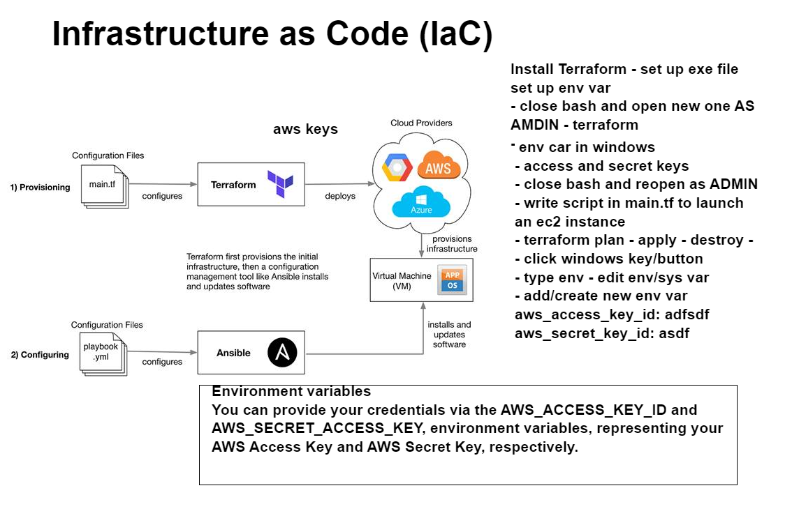
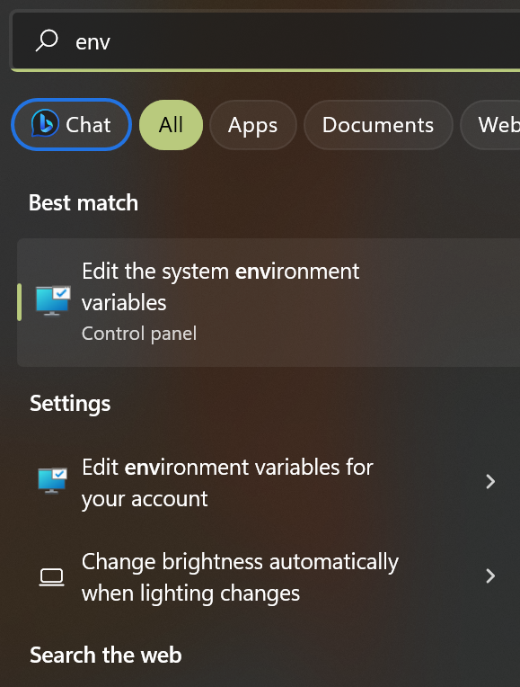
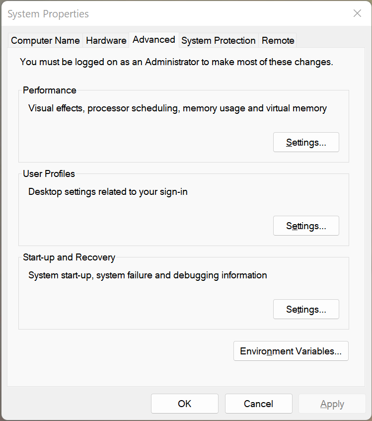
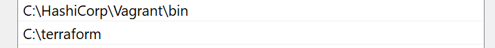
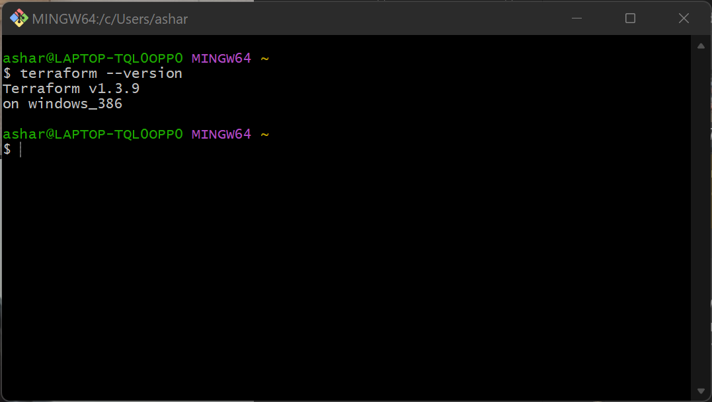
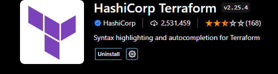
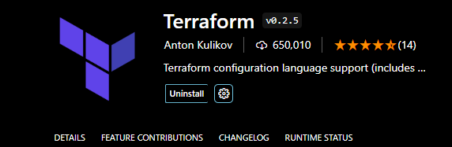
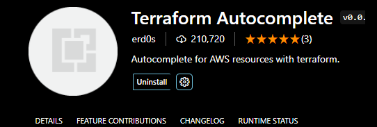
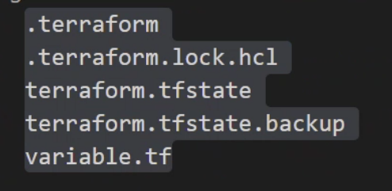

# Terraform

## IaC



## How to install Terraform

https://developer.hashicorp.com/terraform/downloads?product_intent=terraform

- First using the link above you want to downland the version of terraform that's compatible with your computer and extract the .exe file of terraform
- The next stage is to make a directory in you C drive and copy the terraform.exe file into this new folder called terraform
- Once this is done you want to press on the Windows key and search on your local computer for `env` and this should bring up `Edit the system environment variables`



- this should open up a `System Properties` window and from here you can edit your environment variables.



- In the `User variables` you want to your `AWS_ACCESS_KEY_ID` and also add your `AWS_SECRET_ACCESS_KEY`
- In the section beneath we want to edit `Path` in our system variables
- We want to create a new path and just path the path from C drive to terraform 



- Now we want to run GitBash as an administrator and check to see if we have terraform with `terraform --version`



https://www.youtube.com/watch?v=SkcRSJWNRS8

- This video can help with the installing terraform step

Now that we have terraform installed we can use it to provision an ec2 instance using terraform.

- Start by opening us Visual studio code as an ADMINISTRATOR
- you want to create a new project and name it something like `IaC_terraform`
- In this directory we want to create a `main.tf` file and use this file to input our code.
- 
```
# launch ec2
# which cloud proviider - aws

provider "aws" {
    region = "eu-west-1"

}

resource "aws_instance" "app_instance" {
    ami = "ami-0488c2ca4ffe453c3"
    instance_type = "t2.micro"
    associate_public_ip_address = true
    tags = { 
        Name = "abubakar-tech201-terraform-app"

    }
  
}
```

- Tip: you may also want to get some extensions on your vs code to help terraform:







Now we want to open up a bash terminal in our VSCode and run the command `terraform init` and this will give us all the dependencies we need for terraform. (if you don't get `Terraform has been successfully initialized` there may be an issue with your aws keys)

- Before we run our code we want to check our code using `terraform plan` this will let us know if there are any errors in our code
- If there are not any errors we can now create an ec2 instance by running `terraform apply` (you may need to type yes to authorize)
- If we want to then terminate our instance we can run `terraform destroy` (you may need to type yes to authorize)
- **Note** You may also want to create a `.ignore` file to ignore the dependencies when pushing your code to git hub
```
.terraform
.terraform.lock.hcl
terraforrm.tfstate
terraform.tfstate.backup
variable.tf
```




