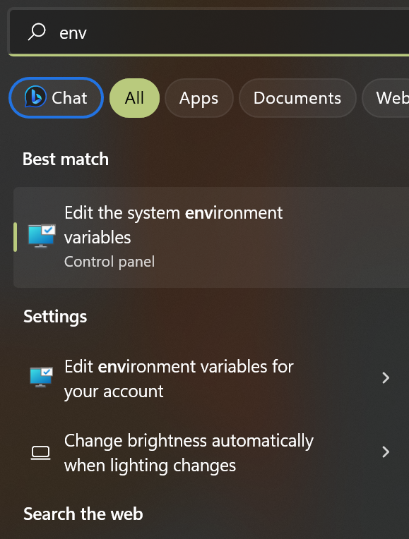
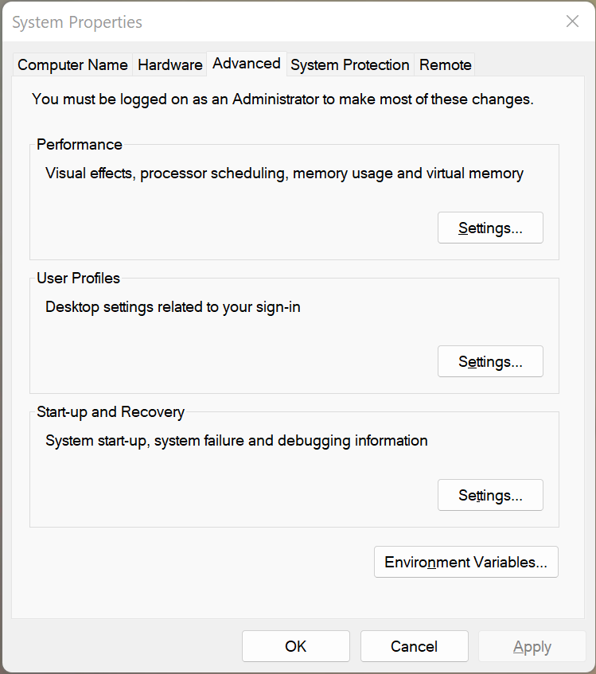
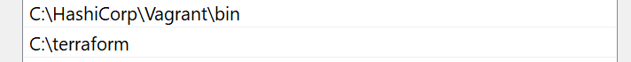
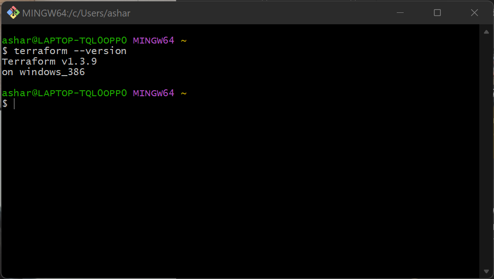

# Terraform

## How to install Terraform

https://developer.hashicorp.com/terraform/downloads?product_intent=terraform

- First using the link above you want to downland the version of terraform that's compatible with your computer and extract the .exe file of terraform
- The next stage is to make a directory in you C drive and copy the terraform.exe file into this new folder called terraform
- Once this is done you want to press on the Windows key and search on your local computer for `env` and this should bring up `Edit the system environment variables`

- this should open up a `System Properties` window and from here you can edit your environment variables.

- In the `User variables` you want to your `AWS_ACCESS_KEY_ID` and also add your `AWS_SECRET_ACCESS_KEY`
- In the section beneath we want to edit `Path` in our system variables
- We want to create a new path and just path the path from C drive to terraform 

- Now we want to run GitBash as an administrator and check to see if we have terraform with `terraform --version`

https://www.youtube.com/watch?v=SkcRSJWNRS8

- This video can help with the installing terraform step

